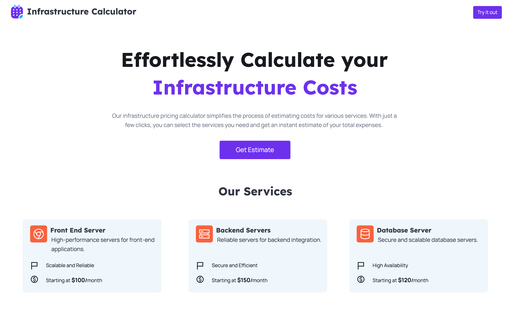

# Moringa Infrastructure Calculator

## Overview

This project aims to provide an easy-to-use, web-based calculator for estimating infrastructure costs based on selected services and packages. This tool will be beneficial for internal sales teams and customers to quickly and accurately calculate costs without manual intervention.

## Features

- **Landing Page:**
  - Display available services and packages in a visually appealing format.
  - Call to action to start the estimation process.

- **Calculator Page:**
  - Allow users to select one or multiple services.
  - Display a running total of the selected services' costs.

- **Logic for Calculations:**
  - Implement the logic to handle service selection and cost calculation.
  - Ensure the selection rules are enforced (e.g., only one package per service can be selected).

### Screenshots

#### Landing Page


#### Calculator Page


## Getting Started

### Prerequisites

- Node.js
- npm

### Installation

1. Clone the repository:

   ```bash
   git clone https://github.com/CarlosMaundu/moringa-infrastructure-calculator.git

## Contributing

We welcome contributions to improve the Pricing Calculator. To contribute:

1. **Fork the repository**.
2. **Create a new branch**:
    ```sh
    git checkout -b feature/your-feature-name
    ```
3. **Make your changes and commit them**:
    ```sh
    git commit -m "Add your feature description"
    ```
4. **Push to the branch**:
    ```sh
    git push origin feature/your-feature-name
    ```
5. **Create a pull request**.

## License

This project is licensed under the MIT License. See the [LICENSE](./LICENSE) file for details.